# 🏗️ Arquitectura del Sistema

## Diagrama de Contexto (C4 - Nivel 1)

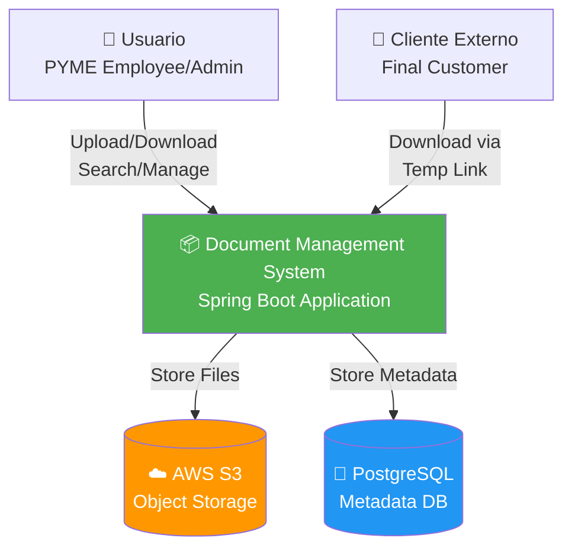

---

## Diagrama de Contenedores (C4 - Nivel 2)

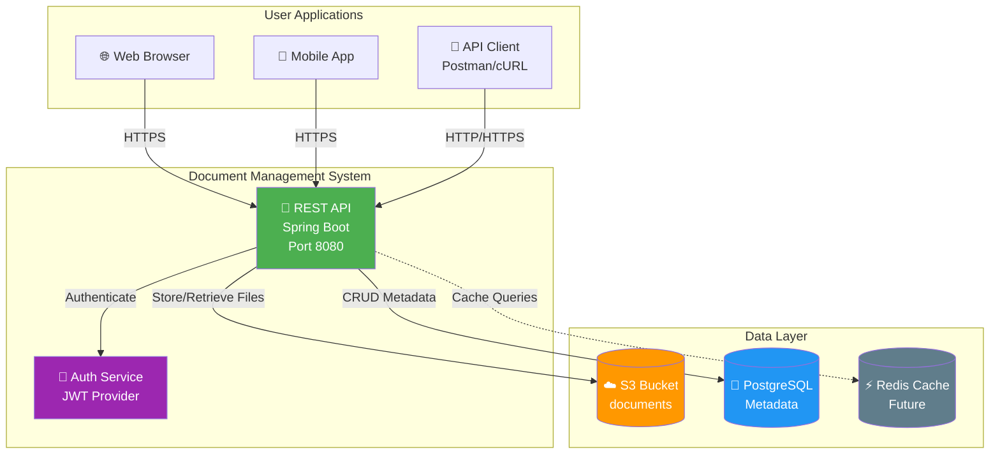

---

## Diagrama de Componentes (C4 - Nivel 3)

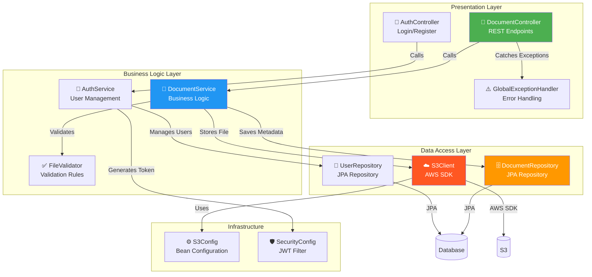

---

## Flujo de Datos: Upload de Documento

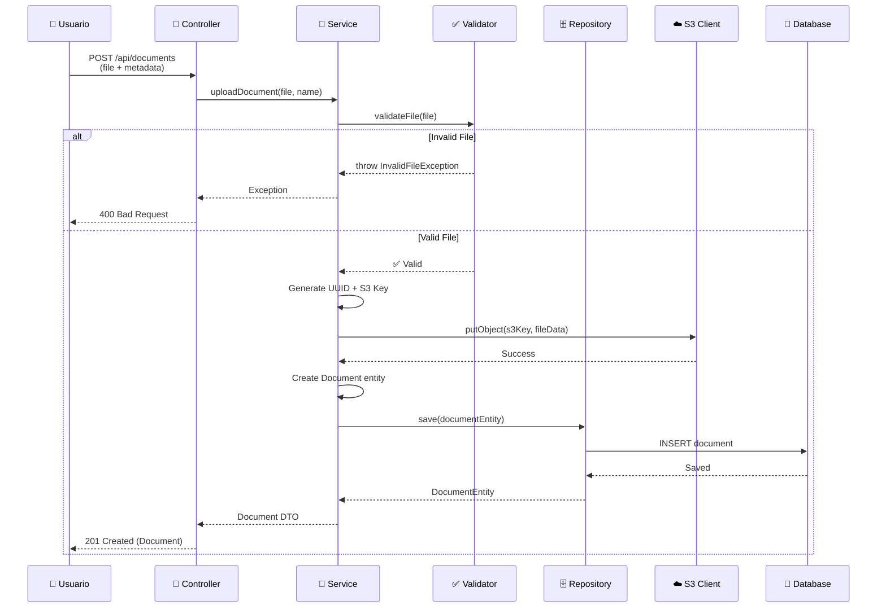

---

## Flujo de Datos: Download de Documento

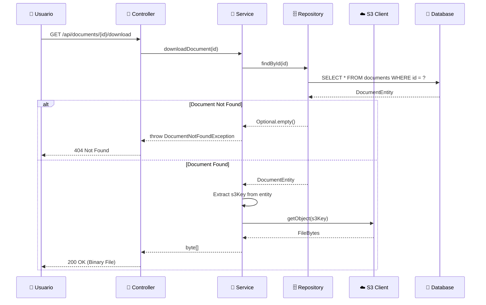

---

## Flujo de Autenticación JWT

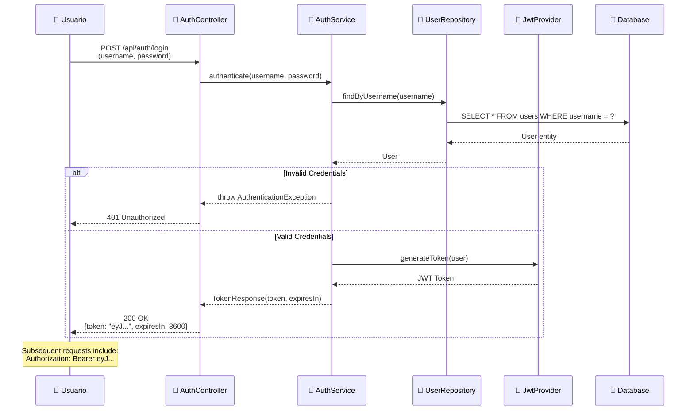

---

## Arquitectura en Capas

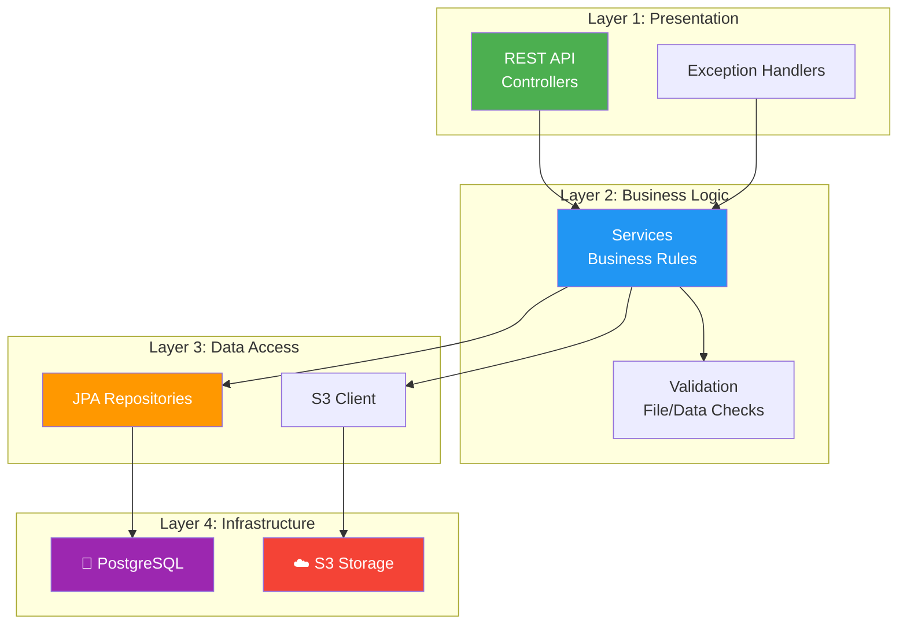

---

## Stack Tecnológico Detallado

| Capa | Tecnología | Propósito |
|------|-----------|-----------|
| **Framework** | Spring Boot 3.4 | Backend framework, IoC, auto-configuration |
| **Web Layer** | Spring Web MVC | REST API, request handling |
| **Security** | Spring Security + JWT | Authentication, authorization |
| **Data Access** | Spring Data JPA | ORM, repository pattern |
| **Database** | PostgreSQL 15 | Relational database for metadata |
| **Storage** | AWS S3 | Object storage for files |
| **Validation** | Jakarta Validation | Input validation |
| **Logging** | SLF4J + Logback | Structured logging |
| **Build** | Maven 3.9 | Dependency management, build |
| **Testing** | JUnit 5 + Mockito + AssertJ | Unit & integration tests |
| **Coverage** | JaCoCo | Code coverage reporting |
| **DevOps** | Docker + Docker Compose | Containerization |
| **CI/CD** | GitHub Actions | Automated testing & deployment |
| **Documentation** | Swagger/OpenAPI | API documentation |
| **Observability** | Spring Actuator + Micrometer | Health checks, metrics |

---

## Decisiones Arquitectónicas (ADRs)

### ADR-001: Arquitectura en Capas
**Decisión**: Usar arquitectura en capas (Controller → Service → Repository)  
**Justificación**: 
- ✅ Separación de responsabilidades
- ✅ Testeable (cada capa independiente)
- ✅ Mantenible y escalable
- ✅ Estándar de la industria

### ADR-002: AWS S3 para Storage
**Decisión**: Usar S3 para almacenar archivos (no filesystem local)  
**Justificación**:
- ✅ Escalabilidad infinita
- ✅ Durabilidad 99.999999999%
- ✅ CDN-ready para distribución global
- ✅ Pay-as-you-go (sin infraestructura upfront)
- ✅ LocalStack permite testing local sin costos

### ADR-003: PostgreSQL para Metadatos
**Decisión**: Usar PostgreSQL en lugar de NoSQL  
**Justificación**:
- ✅ Datos estructurados (documentos, usuarios, permisos)
- ✅ Relaciones complejas (compartidos, versionado)
- ✅ ACID compliant para auditoría
- ✅ Conocimiento amplio en la industria

### ADR-004: JWT para Autenticación
**Decisión**: Stateless authentication con JWT  
**Justificación**:
- ✅ Sin necesidad de sesiones en servidor
- ✅ Escalable horizontalmente
- ✅ Mobile-friendly
- ✅ Soporta microservicios futuros

### ADR-005: Spring Boot 3.x (no 2.x)
**Decisión**: Usar Spring Boot 3.4 (última versión)  
**Justificación**:
- ✅ Java 17+ (features modernas)
- ✅ Jakarta EE (futuro del ecosistema)
- ✅ Performance mejorado
- ✅ Soporte largo plazo

---

## Seguridad en Capas

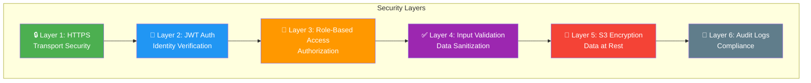

---

## Escalabilidad

### Horizontal Scaling

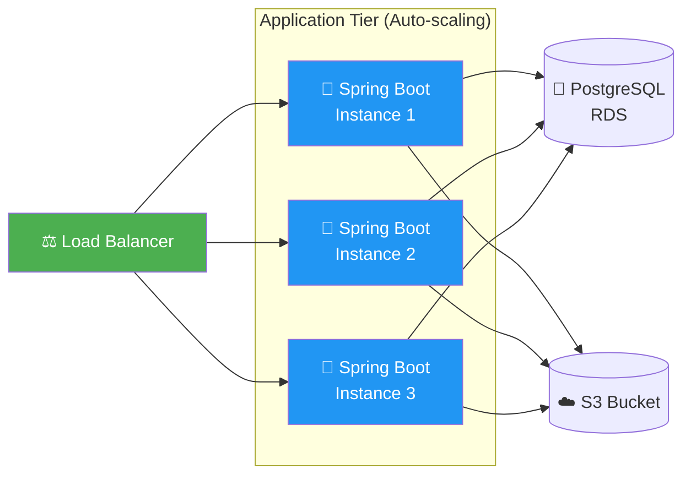

**Stateless Design** permite escalar horizontalmente:
- ✅ JWT = No sesiones en servidor
- ✅ S3 = Storage compartido
- ✅ PostgreSQL = Single source of truth

---

## Monitoreo y Observabilidad

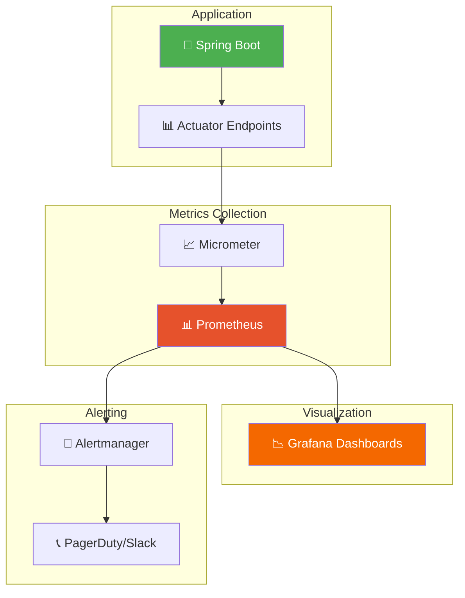

---

## Deployment Architecture

### Local Development
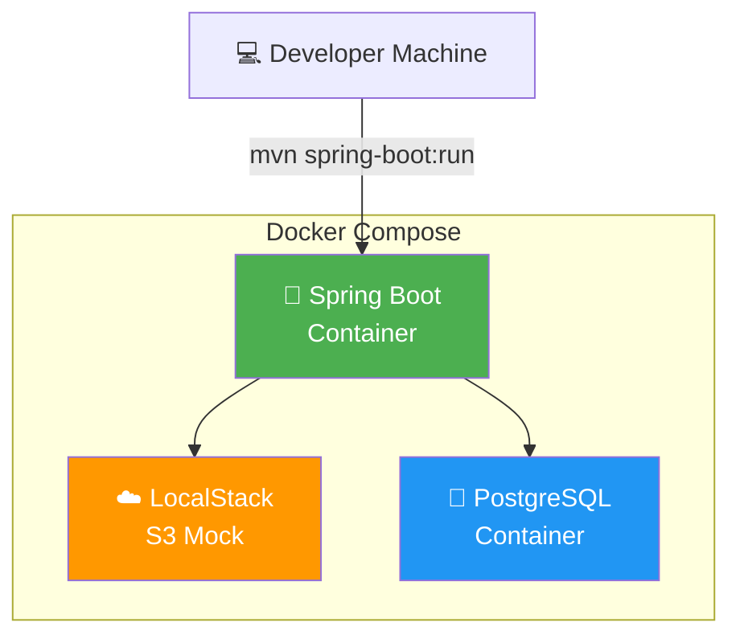

### Production (AWS)
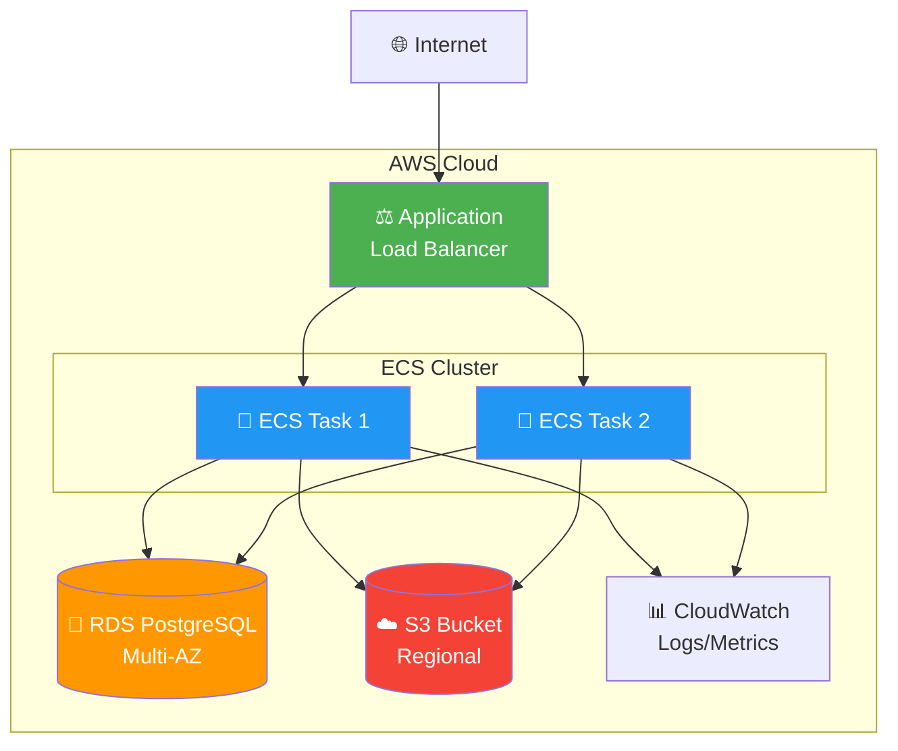

---

## Próxima Evolución: Microservicios

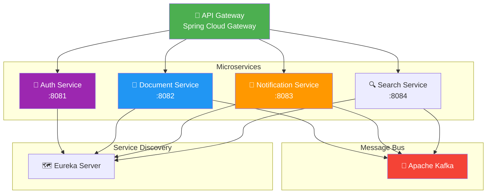

---

## Conclusión

Esta arquitectura demuestra:
- ✅ **Clean Architecture** - Separación clara de capas
- ✅ **Cloud-Native** - Diseñado para la nube desde día 1
- ✅ **Scalable** - Horizontal scaling ready
- ✅ **Secure** - Múltiples capas de seguridad
- ✅ **Observable** - Metrics, logs, health checks
- ✅ **Testable** - Cada componente aislado
- ✅ **Maintainable** - Código organizado y documentado

**Este nivel de arquitectura es lo que empresas buscan en candidatos Senior.**
